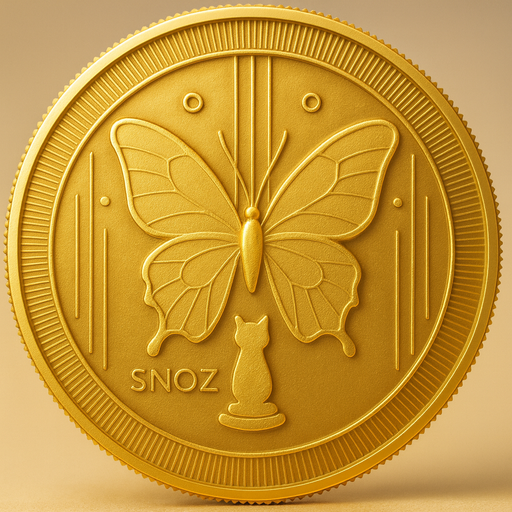

# SNOZCOIN 🦋# SNOZCOIN Website (SNOZ)


<div align="center">This is a lightweight, mobile-first one-page website scaffold for SNOZCOIN ($SNOZ). It uses a premium gold on dark theme, smooth animations, and is SEO-friendly.


Files added:

- `index.html` — main one-page site (hero, about, token overview placeholders, roadmap, community, footer)

[](https://www.stacks.co/)- `css/style.css` — site styles (responsive, gold theme)

[](https://clarity-lang.org/)- `js/main.js` — minimal JS (mobile nav, smooth scroll, reveal on scroll)

[](LICENSE)- `assets/logo.svg` — placeholder gold butterfly coin (replace with your provided logo file if you have one)

[]() - `assets/SNOZCOIN-1024.png`, `assets/SNOZCOIN-512.png`, `assets/SNOZCOIN-128.png` — resized PNGs

[](https://stacks.org/code-for-stx) - `assets/SNOZCOIN-1024.webp`, `assets/SNOZCOIN-512.webp`, `assets/SNOZCOIN-128.webp` — WebP fallbacks (automatically generated)


**The Future of Creator Economy on Stacks**How to view locally:


[Live Demo](https://snozcoin.com) • [Documentation](README_STACKS.md) • [Smart Contracts](stacks-contracts/)1. Open a terminal in this folder and run a simple static server (recommended):


</div>```bash

cd /Users/xworld/Desktop/PROGRAMMING/PROGRAMING/alx/SNOZCOIN

---python3 -m http.server 8000

# then open http://localhost:8000 in your browser

## 🌟 Overview```


SNOZCOIN is a decentralized creator economy platform built on the **Stacks blockchain**, powered by **Bitcoin's security**. Our platform enables creators to monetize their content while rewarding supporters with SNOZ utility tokens.2. Or open `index.html` directly in a browser (some features like `file://` cross-file requests are avoided here, so a local server is best).


### Key PrinciplesReplace the logo:

- `SNOZCOIN.png` is already in `assets/`. I generated optimized sizes and WebP fallbacks. `index.html` now uses responsive `<picture>` tags so browsers will load WebP if supported and fallback to PNG.

- **STX is Money** — STX remains the only monetary currency for all transactions

- **SNOZ is Utility** — Non-speculative utility token for rewards, governance, and platform benefits- Add contract address and live token data when available.

- **Bitcoin-Secured** — All transactions are secured by Bitcoin's proof-of-work- Add an audit badge and links to contract on explorers.

- Add analytics and social meta images for better link previews.

---Next suggestions (low-risk improvements):

- Add contract address and live token data when available.

## 🏗️ Architecture- Add an audit badge and links to contract on explorers.

- Add analytics and social meta images for better link previews.

```- If you want, I can further compress WebP files, create SVG alternatives, or add a deploy pipeline for automatic image optimization.

┌─────────────────────────────────────────────────────────────┐- Add contract address and live token data when available.

│                    SNOZCOIN Platform                        │- Add an audit badge and links to contract on explorers.

├─────────────────────────────────────────────────────────────┤- Add analytics and social meta images for better link previews.

│  Frontend (HTML/CSS/JS)                                     │

│  ├── Wallet Connection (Leather/Xverse)                     │If you want, I can:

│  ├── Creator Dashboard                                      │- Replace the placeholder SVG with the exact provided logo (upload or tell me filename/path).

│  └── Supporter Interface                                    │- Create a deploy-ready package (Netlify/Vercel config) and OG images.

├─────────────────────────────────────────────────────────────┤

│  Smart Contracts (Clarity)                                  │Built with care for speed, accessibility, and a community-first tone.

│  ├── snoz-token.clar          (SIP-010 Token)              │
│  ├── snoz-rewards-engine.clar (Rewards Distribution)        │
│  ├── snoz-governance.clar     (DAO Governance)             │
│  ├── snozcoin-tipping.clar    (Creator Tipping)            │
│  ├── snozcoin-content.clar    (Content Marketplace)        │
│  └── snozcoin-rewards.clar    (Points & Badges)            │
├─────────────────────────────────────────────────────────────┤
│  Stacks Blockchain (Bitcoin L2)                             │
└─────────────────────────────────────────────────────────────┘
```

---

## 🪙 SNOZ Token

| Property | Value |
|----------|-------|
| **Name** | SNOZ Token |
| **Symbol** | SNOZ |
| **Standard** | SIP-010 Fungible Token |
| **Max Supply** | 1,000,000,000 (1 Billion) |
| **Decimals** | 6 |
| **Type** | Non-transferable Utility Token |

### Token Utility

- 🎁 **Rewards** — Earn SNOZ for supporting creators
- 🗳️ **Governance** — Vote on platform decisions
- 🏆 **Tier Benefits** — Unlock premium features based on SNOZ balance
- 🎖️ **Badges** — Exclusive achievements and recognition

### Tier System

| Tier | SNOZ Required | Benefits |
|------|---------------|----------|
| 🥉 Bronze | 100+ | Basic rewards, community access |
| 🥈 Silver | 1,000+ | Enhanced rewards, early access |
| 🥇 Gold | 10,000+ | Premium features, creator tools |
| 💎 Platinum | 100,000+ | VIP access, governance power |
| 👑 Diamond | 1,000,000+ | Elite status, maximum benefits |

---

## 📦 Smart Contracts

All contracts are written in **Clarity** (version 3) and pass `clarinet check`.

### Contract Overview

| Contract | Purpose | Lines |
|----------|---------|-------|
| `snoz-token.clar` | SIP-010 compliant utility token | ~500 |
| `snoz-rewards-engine.clar` | Calculates and distributes SNOZ rewards | ~850 |
| `snoz-governance.clar` | DAO voting and proposal system | ~650 |
| `snozcoin-tipping.clar` | STX tipping for creators | ~500 |
| `snozcoin-content.clar` | Premium content marketplace | ~450 |
| `snozcoin-rewards.clar` | Points, badges, achievements | ~700 |

### Validation

```bash
cd stacks-contracts
clarinet check
# ✔ 6 contracts checked
```

---

## 🧪 Testing

Comprehensive test coverage with **223 tests passing**.

```bash
cd stacks-contracts
npm install
npm test
```

### Test Results

```
 ✓ tests/snoz-token.test.ts (45 tests)
 ✓ tests/snoz-rewards-engine.test.ts (52 tests)
 ✓ tests/snoz-governance.test.ts (38 tests)
 ✓ tests/snozcoin-tipping.test.ts (35 tests)
 ✓ tests/snozcoin-content.test.ts (28 tests)
 ✓ tests/snozcoin-rewards.test.ts (25 tests)

Test Files: 6 passed
Tests: 223 passed
```

---

## 🚀 Getting Started

### Prerequisites

- [Node.js](https://nodejs.org/) (v18+)
- [Clarinet](https://docs.hiro.so/clarinet) (v2.0+)
- [Stacks Wallet](https://www.hiro.so/wallet) (Leather or Xverse)

### Installation

```bash
# Clone the repository
git clone https://github.com/elijahsnoz/SNOZCOIN.git
cd SNOZCOIN

# Install contract dependencies
cd stacks-contracts
npm install

# Run tests
npm test

# Check contracts
clarinet check
```

### Run Locally

```bash
# From project root
python3 -m http.server 8000
# Open http://localhost:8000
```

### Connect Wallet

1. Install [Leather](https://leather.io/) or [Xverse](https://www.xverse.app/) wallet
2. Open the website in Chrome
3. Click "Connect Wallet" button
4. Approve the connection

---

## 📁 Project Structure

```
SNOZCOIN/
├── index.html              # Main website
├── css/
│   └── style.css           # Styles
├── js/
│   ├── main.js             # Core functionality
│   └── snoz-stacks.js      # Stacks integration
├── assets/                 # Images and media
├── stacks-contracts/       # Smart contracts
│   ├── contracts/          # Clarity contracts
│   ├── tests/              # Test files
│   ├── Clarinet.toml       # Clarinet config
│   └── package.json        # Node dependencies
└── docs/                   # Documentation
```

---

## 🔐 Security

### Contract Security Features

- ✅ Admin-only minting controls
- ✅ Rate limiting on rewards
- ✅ Overflow protection
- ✅ Reentrancy guards
- ✅ Input validation
- ✅ Access control lists

### Audit Status

> 🔍 **Pending Audit** — Smart contracts are pending professional security audit. Use at your own risk on mainnet.

---

## 🛣️ Roadmap

### Phase 1: Foundation ✅
- [x] Smart contract development
- [x] Comprehensive test suite
- [x] Frontend integration
- [x] Wallet connection

### Phase 2: Launch 🚧
- [ ] Testnet deployment
- [ ] Security audit
- [ ] Community testing
- [ ] Mainnet deployment

### Phase 3: Growth 📋
- [ ] Creator onboarding
- [ ] Mobile app
- [ ] Additional features
- [ ] Partnerships

---

## 🤝 Contributing

We welcome contributions! Please see our [Contributing Guidelines](CONTRIBUTING.md) for details.

```bash
# Create a feature branch
git checkout -b feat/your-feature

# Make changes and commit
git commit -m "Add your feature"

# Push and create PR
git push origin feat/your-feature
```

---

## 📜 License

This project is licensed under the MIT License - see the [LICENSE](LICENSE) file for details.

---

## 🔗 Links

- **Website**: [snozcoin.com](https://snozcoin.com)
- **GitHub**: [github.com/elijahsnoz/SNOZCOIN](https://github.com/elijahsnoz/SNOZCOIN)
- **Stacks Explorer**: [explorer.stacks.co](https://explorer.stacks.co)
- **Documentation**: [README_STACKS.md](README_STACKS.md)

---

## 👥 Team

Built with ❤️ by the SNOZCOIN team

**Deployer Address**: `SP1PTBC7PP2X11N7M3K2BTF5HWRDK4J8QMGNFTEY5`

---

## ⚠️ Disclaimer

This software is provided "as is" without warranty of any kind. Smart contracts have not been audited. Do not use with funds you cannot afford to lose. Always do your own research (DYOR).

---

<div align="center">

**Powered by Stacks • Secured by Bitcoin**


</div>
